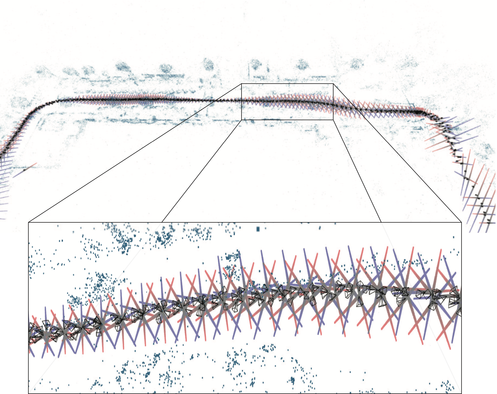

# Visualizing Spectral Bundle Adjustment Uncertainty
Kyle Wilson and Scott Wehrwein, 3DV 2020.

## Abstract
Bundle adjustment is the gold standard for refining solutions to geometric computer vision problems. This paper develops an uncertainty visualization technique for bundle adjustment solutions to Structure from Motion problems.

Propagating uncertainty through an optimization–from measurement uncertainties to uncertainties in the resulting parameter estimates–is well understood. However, the calculations involved fail numerically for real problems. Often we cope by considering only individual variances, but this ignores the important mutual dependencies between parameters. The dominant modes of uncertainty in most models are large motions involving nearly all parameters at once. These frequently look like flexions, stretchings, and bendings in the overall scene structure.

In this paper we present a numerically tractable method for computing dominant eigenvectors of the covariance of a Bundle Adjustment solution. We pay careful attention to the mismatched scales of rotational and translational parameters. Finally, we animate this spectral information. The resulting interactive visualizations (included in the supplemental) give insight into the quality and failure modes of a model. We hope that this work is a step towards broader uncertainty-aware computation for Structure from Motion.



## Overview
This repository contains:
- Interactive web visualizations that accompany our 3DV20 paper
- The research code that produces these visualizations

## Visualizations
These visualizations are included in the supplemental to our paper. We also post them here. Please see the supplemental commentary for interpretive remarks. 

### How to run the demos
Please clone this repository. There are HTML files for each scene in the `visualizations` directory. Open these in any web browser (tested: Firefox, Chrome, Safari). 

### Demo controls

Action | Control
-------|------------
Rotate the model | `click + drag`
Translate the model | `altclick + drag`
Next/previous eigenvector | `j/k`
Increase/decrease translation scale | `h/l`
Increase/decrease rotation scale | `g/;`
Help popup | `?`

## Research Code
The code pipeline works as follows:
- Given a Structure from Motion problem instance in the format of [Bundle Adjustment in the Large](https://grail.cs.washington.edu/projects/bal/) or [Bundler](https://www.cs.cornell.edu/~snavely/bundler/)
- Run a stock bundle adjuster to guarantee that we are at a local minimum (otherwise the Gauss-Newton approximation will be terrible!)
- Extract the problem parameters and its derivatives and save them out to an HDF5 file.
- Read the HDF5 file, compute eigenvectors, and save the eigenvectors and scene parameters to a JSON file.
- Load the JSON file and display an interactive visualization.

The preprocessing stages are based on [ceres-solver](http://ceres-solver.org/) and its included bundle adjuster. This is in C++. The eigenvector computations are performed in Julia, and the final interactive visualization is based on ThreeJS in Javascript.

### Setup and Building
The `C++` targets depend on `Eigen`, `GFlags`, `Glog`, and `hdf5`. They also require `ceres-solver`, which should be [built from source](http://ceres-solver.org/installation.html). Be sure to build ceres with `suite-sparse`.

For convenience on Ubuntu: `apt-get install libeigen3-dev libgoogle-glog-dev libgflags-dev libhdf5-dev`

Also, download the header-only library [HighFive](https://github.com/BlueBrain/HighFive):
```
# from the sfmflex-release/code/ directory
mkdir lib && cd lib
git clone https://github.com/BlueBrain/HighFive.git
```

To build the `C++` targets:
```
# from the sfmflex-release/code/ directory
mkdir build
cd build
cmake ..
make
```

The Julia code also has many dependencies. Install all of these by running `julia deps.jl` from the `code/` directory.

### Datasets
We have run our method on two datasets: 
1. [Bundle Adjustment in the Large](https://grail.cs.washington.edu/projects/bal/) problems
2. [1DSfM](https://research.cs.cornell.edu/1dsfm/) problems
A script is provided below to scrape and download all of the BAL problems. The 1DSfM problems are available as a single download from the 1DSfM project page.

### Scripts and bins
Run all of these scripts from the `code/` directory.

**Preprocessing scripts:**
+ `build/bin/compute_jacobian <bal_problem> <jac_file>` : compute the Jacobian of a bundle adjustment problem.
+ `build/bin/bundle_adjuster` : an all-purpose bundle adjuster, lightly tweaked from the ceres-solver [example](https://github.com/ceres-solver/ceres-solver/blob/master/examples/bundle_adjuster.cc). There are many command line options.

**Dataset scripts:**
+ `julia scripts/download_bal.jl` : scape, download, and decompress all of the BAL datasets. Store them at `dataset/bal/`.
+ `julia scripts/run_ba_on_bal.jl` : run a bundle adjuster on all BAL problems found. This takes a long time.
+ `julia scripts/bundle2bal.jl <bundle_file> <bal_file>` : convert problem formats from a bundler .out problem instace to a BAL problem instance.

**Pipeline scripts**
These script don't take CLI options---edit their options in the file.
+ `julia scripts/generate_json_for_vis.jl` : pipeline script to take a BAL-format and produce a json file suitable for running in the visualizer. 
+ `julia scripts/run_1dsfm_datasets.jl` : run all the 1dsfm problems through the pipeline and generate vis files.

### Viewing the Visualizations
(write this ...)

### File Formats

**BAL problems**
The Bundle Adjustment in the Large datasets use the same camera model as Bundler. See the [project page](https://grail.cs.washington.edu/projects/bal/) for details. Notice that unlike Bundler, the 2D coordinate system has its origin at the image center.

The BAL (and Bundler) cameras map 3D world coordinates `X` into 3D camera-centered coordinates `Y` via `Y = R*X + t`.

The camera parameters are ordered as:
```
r1, r2, r3, t1, t2, t3, f, k1, k2
```

**Jacobian text files**
(Some older code stores Jacobians in text files. This has been mostly replaced by HDF5 files for performance.)

The first line of each file gives dimensions:

```
num_cameras num_points num_observations
```

The remainder of the file gives the Jacobian in `(i, j, value)` sparse triplets.

The Jacobian has dimensions `(2*num_residuals) x (9*num_cameras + 3*num_points)`. The cameras are ordered first, and then the points, using the indexing of the source problem.

For now, no robust loss is applied when computing the Jacobian. This seems like an oversight that we'll have to come back to.

**Bundle Adjustment problem HDF5 files**
See `jl/JacobianUtils.jl:readproblem()` for details about how a Bundle Adjustment problem is stored in an HDF5 file. Both a solution and its Jacobian, along with some other metadata, are all stored in binary format.

**Visualization JSON files**
We use json files to hold a scene + eigenvectors description in a way that is easy to read into our WebGL visualizer. See `scripts/generate_json_for_vis.jl` for a sample script that takes a BAL problem and outputs a vis json.

These json files are dictionaries at the base level containing the following fields:
+ `num_cameras`
+ `num_points`
+ `camera_parameters` : a `9*num_cameras` vector of `doubles`. Parameter block order matches BAL: `r1 r2 r3 t1 t2 t3 f k1 k2`. The camera rotation matrix `R` is given by its angle-axis representation `r1 r2 r3`. Notice that camera centers are not `t1 t2 t3` but rather `C=-R'*t`.
+ `point_parameters` : a `3*num_points` vector of `doubles`. This is the 3D coordinates of every point in the scene.
+ `eigenvectors` : a list of eigenvectors. The first eigenvector corresponds to the direction of highest variance, with the vectors ordered in descending order. Each eigenvector is a `6*num_cameras` vector of `doubles` with parameters blocks ordered as `r1 r2 r3 t1 t2 t3`.

To make it easy to read into JavaScript, the base level dictionary has a name:
```
sample_scene = {...}
```
(yes, this is hacky...)